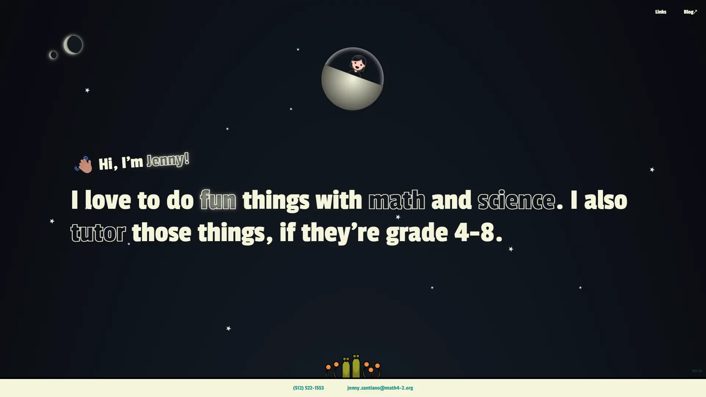
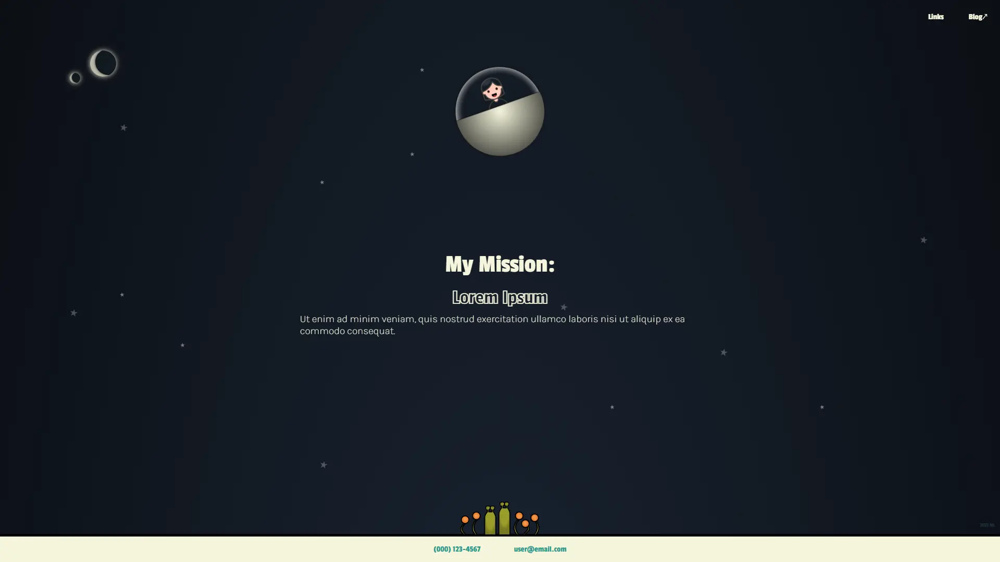
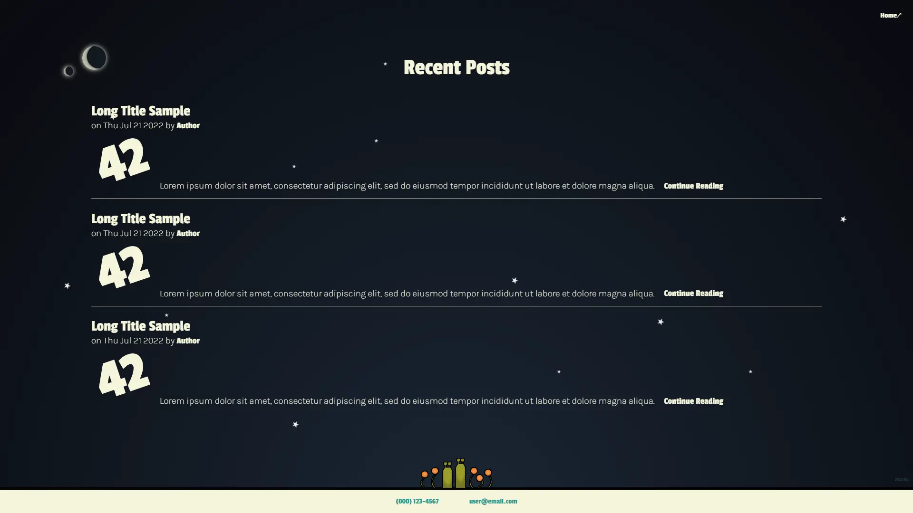
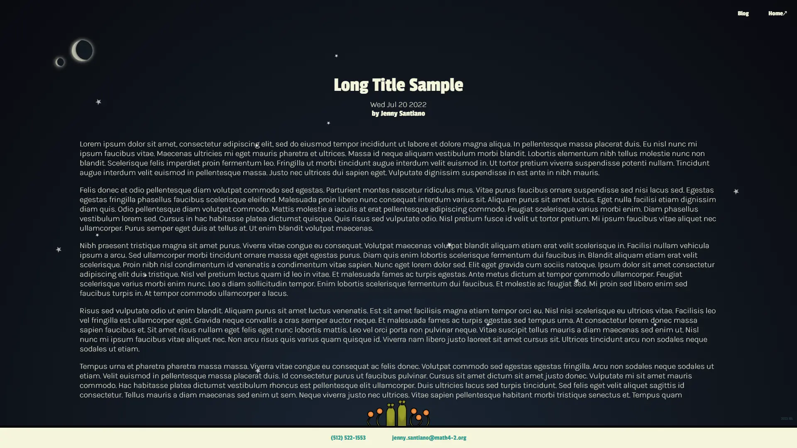
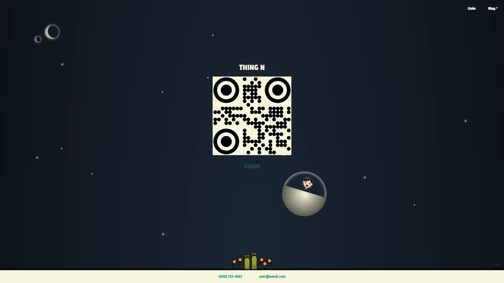

# Math 4-2 Website

Jamstack website built with Node, Nunjucks & CSS, Eleventy & Netlify CMS.
[Homepage](https://math4-2.netlify.app)

## Screenshots

### Main

### Content

### Blog

### Post

### Modal

## License
[MIT](https://choosealicense.com/licenses/mit/)